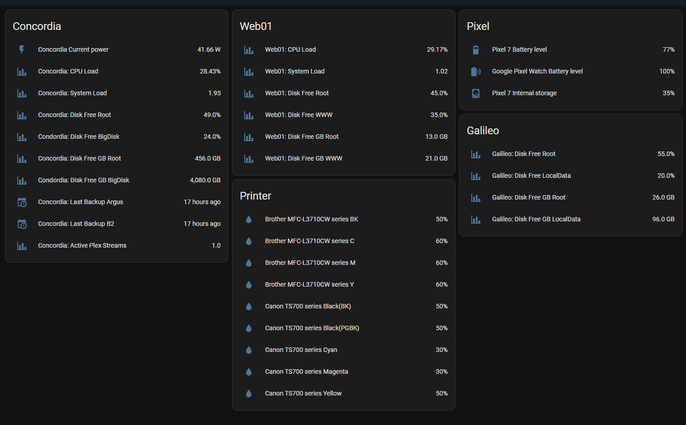

# homeassistant-quick-telemetry

Lets say you have a variety of linux systems and you need to create one liner bash commands that relay to home assistant the state of the system, such as disk free or cpu load, or that an event happened, such as a backup.

This repoistory solves this problem with a few scripts which relay the appropriate messages into home assistant via mqtt.

I have included a few scripts that should get you 90% of the way there.

Configuration:

- Put a random string in for "SECRET_TOKEN" in both telemetry.sh and telemetry.py.
- Configure your MQTT connection in telemetry_server.py.
- Setup telemetry_server.py on a computer which can receive traffic from the internet.  I use docker container jrcs/letsencrypt-nginx-proxy-companion/ to set up https and a virtual host for the application.
- Configure telemetry_client.sh with the URL endpoint which is received by telemetry_server.py.
- Put telemetry.sh on each system you wish to use it on.
- Run telemetry.sh for help examples on what kinds of commands you can use to send telemetry to home assistant.
- Optionally configure telemetry_periodic.sh to collect relevant information for your system and run telemetry_periodic.sh from cron every 5 minutes (*/5 * * * *)

